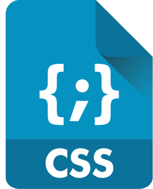

<h1 align="center">Hi 👋, I'm Mai Srour</h1>
<h3 align="center">A frontend developer from Egypt</h3>

I'm a front-end developer and fresh graduate of faculty of computer science (information system department) , I've a good experience in implementing websites, internal framework , with good understanding of system design , dealing with designers

<h3 align="left">Experience:</h3>
<h4>front-end developer at pioneer company </h4>

I was responsible for programming and developing parts of the front-end interfaces of the ERP system, and I made modifications and added a set of forms, each form dedicated to a specific task, using htm ,css ,js ,bootstrap and vue.js
 

<h3 align="left">Connect with me:</h3>
<ul>
 <li>
  <a href="https://www.linkedin.com/in/mai-srour" target="_blank">linkedin</a>
 </li>
 <li>
  <a href="https://wa.me/01013553783" target="_blank">whatsapp</a>
 </li>
 <li>
  <a href="#">
   (+20) 1013553783</a>
 </li>
 <li>
  <a href="https://www.facebook.com/mai.srour.1"  target="_blank">facebook</a>
 </li>
  <li>
  <a href="https://twitter.com/mai__srour  target="_blank"">twitter</a>
  </li>   
 </ul>

<h3 align="left">Languages and Tools:</h3>

 
  
 
 
 

  
   
   
   

